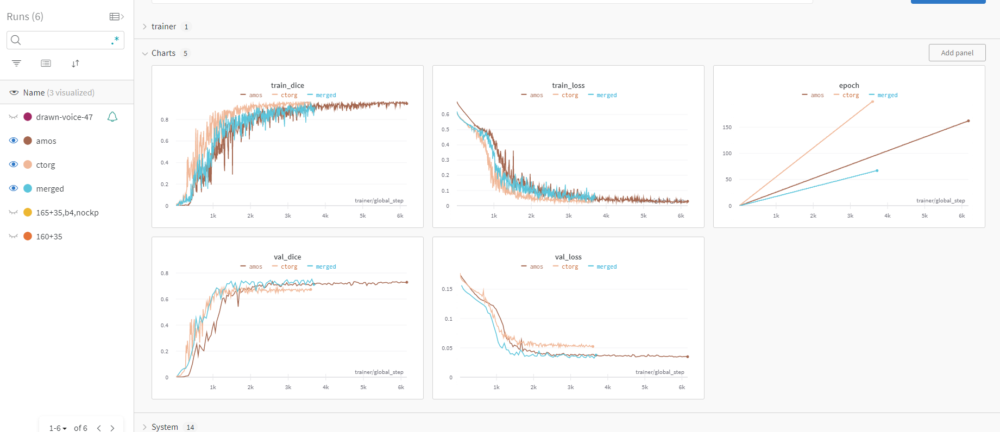

# bladder_segmentation
Guided Research for Bladder Segmentation from CT and PET images

Main points:
- use resize_amos.py, resize_ctorg.py, then merge_amos_ctorg.py to create the merged dataset
- you can play around with the spacings/dimensions in those files
- the output folder should be directly runnable with nnUNet

##
Prerequisites:
- a training setup (Polyaxon / what else is currently being used)
- having write access to your NAS directory 
- having access to the raw AMOS and CT-ORG datasets in the NAS
- wandb
## Explanation for each of the files:

### wandb_login.py
I created a file name `wandb_login.py` and called it to login into wandb at every run, so I don't have to post my private credentials anywhere
It's just a python script you call before running the training, and it has two lines:
`import os`
`os.system("wandb login --relogin <your_token>")`
With the logging I set up, your dashboard should look like this

### resize_amos and resize_ctorg 
Both do the preprocessing steps on the 3d volumes and their respective labels.
They take the (volume,label) pair from their initial folders, create a segmentation mask (the initial volumes for both CT-ORG and AMOS have multiple classes)

### train.py
An adaptation of https://github.com/Project-MONAI/tutorials/blob/main/3d_segmentation/spleen_segmentation_3d_lightning.ipynb

### 3d_vis.ipynb
Can use to visualise slices if you don't have ImFusion

### Extras
- in the `polyaxonfile.yaml` I specified some GPUs are upset at the pytorch version being used
- you can search for pytorch images here https://hub.docker.com/r/pytorch/pytorch/tags. MONAI (https://hub.docker.com/r/projectmonai/monai/tags) took too long for me to download
- i recommend not putting `polyaxon-cli` in your requirements.txt. The version used at IFL is older and it has some dependency conflicts with other packages such as wandb/jupyter
- `pred.py` is patched together so it can run on the folder format i had on the internal data. Modify it as needed
